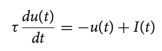
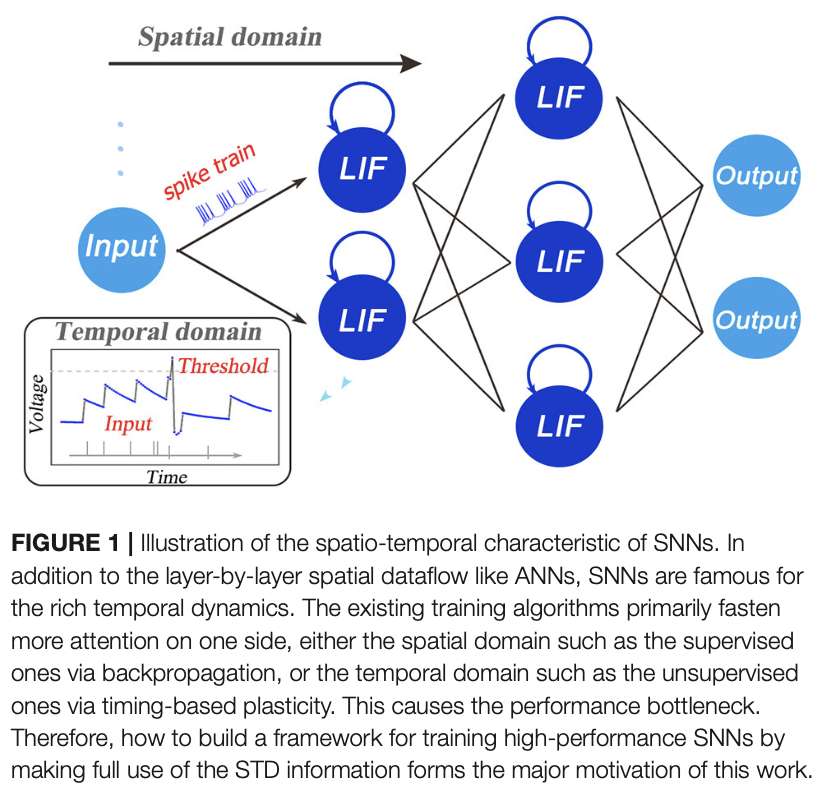
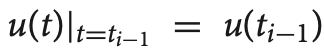
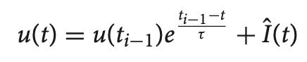
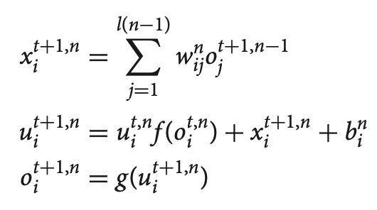
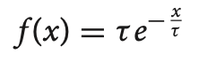
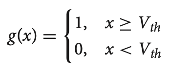
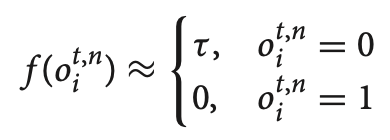
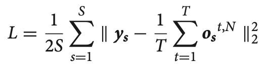
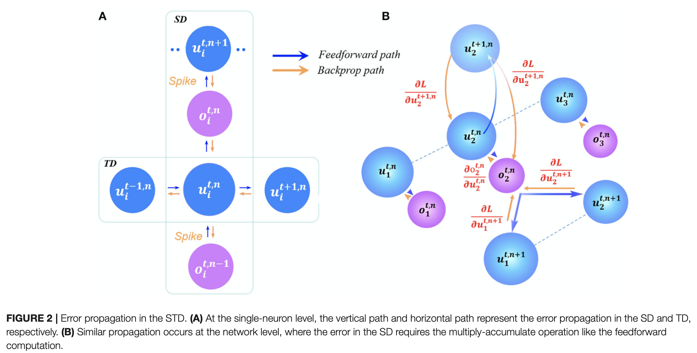

# Spatio-Temporal_Backpropagation_for_Training_High-Performance_Spiking_Neural_Networks

## Abstract

- SNN
  - 编码时空信息，模仿人脑
- 训练SNN
  - 从ANN进行与训练，或者直接采用反向传递来训练（BP）
  - 问题
    -  这种方法集中关注的是空间域信息，会忽略时域的动态性，会导致性能瓶颈和很多的训练方法
    - 脉冲信号是不可微的，带来困难
- STBP
  - 近似脉冲信号，直接梯度下降
  - 结合空间域和时间域
  - 不需要特殊训练技巧
  - 在MNIST、自定义目标检测和N-MNIST上做测试

## 1 Introduction

- 总结了一堆
- 得出结论：在SNN上设计通用的动态模型和训练算法是很有意义的
- 我们的贡献
  - 建立了一个迭代LIP模型，具有SNN动态，可用梯度下降
  - 在反向传递时同时考虑空间域和时间域，提高网络精度
  - 近似，解决脉不可微
  - 避免任何复杂的训练方法
  - 最佳精度
  - 系统地分析了时域动态和不同近似方法

## 2 Methods and Materials

### 2.1 Iterative Leaky Integrate-And-Fire Model

- LIF模型是用来描述SNN神经元动态的常用模型

  

  

  - 参数解释
    - $u(t)$：$t$时刻的神经元膜电位
    - $\tau$：时间常数
    - $I(t)$：神经元突触前输入（此前的活动/外部刺激和权重共同确定）
  - 图解释
    - 前向传递像DNN一样，空间域；每个神经元有自反馈，非易失性整合
    - 采用脉冲的方式将时空域信息编码
    - 当前的训练方式只关注空间域或者时间域中的一个

- 训练

  - 直接获得解析解是很不方便的（在连续的时间域中有很复杂的动态）

  - 解决这个问题，我们先把初始条件代入前面的微分方程，可以得到（没想通是怎么来的）

    

  - 膜电位呈指数衰减（遗忘），直到接收到新的输入，再次更新

  - 误差反向传递启发，提出了基于SNN的LIF迭代

    

    其中

    

    

  - 参数解释

    - $t$：第$t$步
    - $n$，$l(n)$：第$n$层和这层的神经元个数
    - $w_{ij}$：从$j_{th}$传递到$i_{th}$层的权重
    - $o_{j}\in \{0,1\}$：神经元的输出，1是激活，0是什么都没有发生
    - $x_i$：第$i_{th}$层的前输入$\hat{I}(t)$的简化表达
    - $b_i$：和激活阈值等效的变量

  - 可调偏差$b$能够用于模拟阈值问题

  - $f(.)$模拟遗忘机制，$g(.)$模拟激发脉冲，当$\tau$很小时，有近似：

    

- LIF转换成了迭代版本，明确了时空域的递归关系，可以用于梯度下降训练

### 2.2 Spatio-Temporal Backpropagation Training Framework

- loss函数设计，给定时间窗口$T$下所有样本的平均平方差：

  

- 参数解释

  - $\mathbf{y_s}$：第$s$个输入样本的标签向量
  - $\mathbf{o_s}$：最后一层书输出向量

- $L$是$W$和$b$的函数，需要求$W$和$b$的导数

- $\frac{\partial L}{\partial o_i}$和$\frac{\partial L}{\partial u_i}$对于计算$\frac{\partial L}{\partial \mathbf{W}}$和$\frac{\partial L}{\partial \mathbf{b}}$很重要

- 空间域和时间域中的误差传递示意图

  

  - 左图是神经元等级的，右图是网络等级的
  - 

